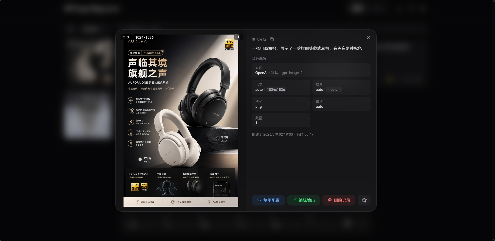
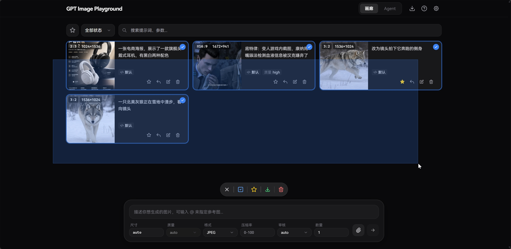
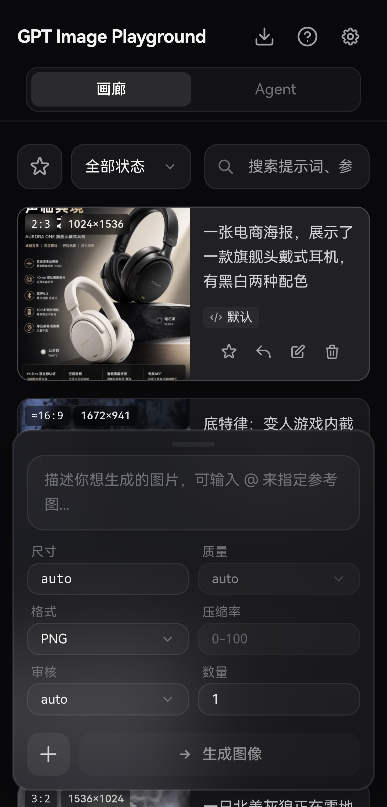

<div align="center">

# 🎨 GPT Image Playground

[](./LICENSE)
[](https://react.dev/)
[](https://www.typescriptlang.org/)

**A local-first, extensible creative workbench for image generation and editing**

提供简洁精美的 Web UI，支持 OpenAI / OpenAI 兼容接口、fal.ai 与可导入的自定义 HTTP 服务商。<br>
支持文本生图、参考图与遮罩编辑，采用本地优先的数据存储方式，带来流畅的历史记录与参数管理体验。

</div>

> 💡 **提示**：若需调用非 HTTPS 的内网或本地 HTTP API，请优先使用本地开发环境或你自己的静态部署版本；某些托管域名会因浏览器安全策略要求接口必须为 HTTPS。

---

## 📸 界面预览

<details>
<summary><b>点击展开截图展示</b></summary>
<br>

<div align="center">
  <b>桌面端主界面</b><br>
  
</div>

<br>

<div align="center">
  <b>任务详情与实际参数</b><br>
  
</div>

<br>

<div align="center">
  <b>桌面端批量选择</b><br>
  
</div>

<br>

<div align="center">
  <b>桌面端连续创作模式</b><br>
  
</div>

<br>

<div align="center">
  <b>移动端主界面</b><br>
  
</div>

<br>

<div align="center">
  <b>移动端侧滑多选</b><br>
  
</div>

</details>

---

## 🧭 项目状态

- 当前仓库已可直接本地运行，也适合作为二次开发起点。
- 默认采用 `local-first` 结构：历史、参数和图片记录优先存储在浏览器本地。
- 适合个人创作、自托管使用，或作为你自己的图像工作台前端基础仓库。

---

## ✨ 核心特性

### 🎨 强大的图像生成与编辑
- **参考图与遮罩**：支持上传最多 16 张参考图（支持剪贴板和拖拽）。内置可视化遮罩编辑器，自动预处理以符合官方分辨率限制。
- **批量与迭代**：支持单次多图生成；一键将满意结果转为参考图，无缝开启下一轮修改。
- **流式生成预览**：`Images API` 与 `Responses API` 模式均支持流式接收中间步骤图像，缓解连接超时问题。

### 🤖 连续创作模式（进阶）
- **多轮对话与上下文记忆**：基于 Responses API 的对话式生成，适合连续追改、比较方向和沿用上轮结果；支持 `@` 引用参考图或前面轮次生成的图片，并自动识别上下文中的图片。
- **并发批量生成**：内置 `generate_image_batch` 工具，可在一次轮次中并发生成多张关联图像，并通过 `continue_generation` 自动追加新一轮以处理依赖关系。
- **分支与重新生成**：编辑某轮消息重新发送或重新生成某轮消息会产生可切换的分支，引用解析严格限定在当前分支路径内，避免误用其他分支的图片。
- **作品流同步与隔离删除**：连续创作生成的图片会同步到作品流；删除对话默认保留作品流记录，删除作品流任务时也会自动清理对话中残留的图片引用。
- **可选 Web 搜索**：可开启 `web_search` 工具，连续创作会在需要时搜索网络信息并附带引用链接。

### ⚙️ 精细化参数追踪
- **智能尺寸控制**：提供 1K/2K/4K 快速预设，自定义宽高时会自动规整至模型安全范围（16 的倍数、总像素校验等）。
- **实际参数对比**：自动提取 API 响应中真实生效的尺寸、质量、耗时以及**模型改写后的提示词**，与你的请求参数高亮对比。支持定制化的参数列表横向平滑滚动体验。

### 📁 高效历史管理 (纯本地)
- **瀑布流与画廊**：历史任务自动保存，支持按状态过滤、全屏大图预览与快捷下载。
- **快捷批量操作**：桌面端支持鼠标拖拽框选、Ctrl/⌘ 连选，移动端支持顺滑侧滑多选；轻松实现批量收藏与清理。
- **优化的图片查看与下载**：大图预览支持左右滑动切换、移动端长按弹出操作菜单，支持快捷下载与批量下载。
- **极致性能与隐私**：所有记录与图片均存放在浏览器 IndexedDB 中（采用 SHA-256 去重压缩），不经过任何第三方服务器。支持一键打包导出 ZIP 备份。

### 🔌 多配置与服务商增强
- **多配置管理**：支持创建并保存多个 API 配置（包含服务商、API Key、模型等），按需快速切换；支持一键复制当前配置到列表底部，并通过拖拽对配置列表与服务商列表进行自定义排序。
- **多服务商接入**：内置 OpenAI 兼容接口（含 `Images API` 和 `Responses API`）、fal.ai（支持队列），并支持通过 JSON 导入自定义 HTTP 服务商配置（兼容同步/异步任务）。
- **API 代理**：OpenAI 兼容接口与 fal.ai 均可配置自定义代理。其中 OpenAI 兼容接口可开启同源 `/api-proxy/` 代理，交由 Docker 或本地开发环境转发至真实 API，绕开浏览器 CORS 限制。
- **Codex CLI 兼容模式**：对上游为 Codex CLI 的 API，开启后应用 Codex CLI 实际支持的参数，并将多图生成拆分为并发单图。
- **提示词防改写**：Responses API 会始终在请求文本前加入强制指令防止提示词被改写；开启 Codex CLI 模式后，Images API 也会获得同等保护。
- **智能诊断提示**：当检测到接口异常改写行为或缺少常规参数时，自动提示开启相应的兼容模式。
- **习惯配置**：支持设置提交后清空输入、重启后保留历史输入、临时复用历史任务 API 配置等。

---

## 🚀 快速开始

如果你想先把它作为一个可直接运行的图像创作工作台来使用，建议按下面这条最短路径开始：

1. 本地启动
2. 配置自己的 API
3. 直接开始生图、保存历史、迭代方案

推荐命令：

```bash
npm install
npm run dev
```

如果希望预设默认 API 地址，可在项目根目录新建 `.env.local`：

```bash
VITE_DEFAULT_API_URL=https://api.openai.com/v1
```

> 推荐先从本地开发模式开始，再按需要接入代理、Docker、Vercel 或 Cloudflare Workers。

> 连续创作属于进阶模式，适合连续迭代、追改和分支比较；如果只是日常单次生图，优先使用作品流即可。

---

## 🚀 部署与使用

支持多种使用与部署方式。默认推荐本地开发与静态构建；其余部署方式适合后续上线、自托管或二次分发使用。

<details open>
<summary><strong>💻 方式一：本地开发与静态构建（当前推荐）</strong></summary>

**1. 环境准备与启动**

你可以在项目根目录新建 `.env.local` 文件配置默认 API URL（如 `VITE_DEFAULT_API_URL=https://api.openai.com/v1`）。然后安装依赖并启动：

**导入自定义服务商配置**：`VITE_DEFAULT_API_URL` 除了填写普通 API 地址外，也支持直接填写 `.json` 配置 URL 或带 `settings` 参数的分享 URL。设为配置 URL 时，页面启动后会自动导入其中的自定义服务商和 API 配置，设置页显示的是配置 JSON 中 profile 定义的 `baseUrl`（而非配置 URL 本身）。

```bash
npm install
npm run dev
```

**2. 本地开发跨域代理 (可选)**

如果在本地开发时遇到浏览器的 CORS 限制，可开启本地代理转发：

```bash
cp dev-proxy.config.example.json dev-proxy.config.json
```

修改 `dev-proxy.config.json`，将 `target` 设置为真实的完整 API 基础地址。代理不会自动补 `/v1`，OpenAI 兼容接口通常必须填写到版本前缀，如 `https://api.example.com/v1`。重启开发服务器后，在页面设置中开启 **API 代理** 即可（请求将被转发如 `http://localhost:5173/api-proxy/... -> target/...`）。此功能仅在 `npm run dev` 阶段生效，不会影响打包产物。

**3. 本地故障模拟 API (可选)**

如果需要复现图片 URL 跨域、接口返回结构异常、原始响应查看等问题，可启动内置模拟服务：

```powershell
npm run mock:api
```

使用方式见 [本地故障模拟 API](docs/mock-image-api.md)。

**4. 构建静态产物**

```bash
npm run build
```

构建输出的文件位于 `dist/` 目录下，可将其部署至任何静态文件服务器（如普通 Nginx、GitHub Pages、Netlify 等）。

</details>

<details>
<summary><strong>▲ 方式二：Vercel 一键部署</strong></summary>

将当前仓库导入到你的 Vercel 项目后，Vercel 会自动执行构建并部署静态文件。

**配置默认 API URL**：在 Vercel 项目的 **Settings → Environment Variables** 中添加 `VITE_DEFAULT_API_URL`（如 `https://api.openai.com/v1`），然后重新部署即可生效。

**导入自定义服务商配置**：`VITE_DEFAULT_API_URL` 除了填写普通 API 地址外，也支持直接填写 `.json` 配置 URL 或带 `settings` 参数的分享 URL。设为配置 URL 时，页面启动后会自动导入其中的自定义服务商和 API 配置，设置页显示的是配置 JSON 中 profile 定义的 `baseUrl`（而非配置 URL 本身）。

**绑定自定义域名**：如果你需要稳定对外访问，请在 Vercel 项目的 **Settings → Domains** 中绑定你自己的域名。

**自动更新**：按你自己的 Git / CI 流程配置自动部署即可；当前仓库内已包含基础的 `vercel.json`。

</details>

<details>
<summary><strong>☁️ 方式三：Cloudflare Workers 部署</strong></summary>

项目已内置 Wrangler 配置，可将 Vite 构建产物作为 Cloudflare Workers 静态资源部署。

**1. 登录 Cloudflare**

```bash
npx wrangler login
```

**2. 部署到 Workers**

```bash
npm run deploy:cf
```

部署脚本会先执行 `npm run build`，再通过 `wrangler deploy` 上传 `dist/` 目录。

**配置默认 API URL**：Cloudflare Workers 的环境变量不会自动改写已经构建好的静态文件。若需预设默认 API 地址，请在构建前设置 `VITE_DEFAULT_API_URL` 后再部署。

```bash
VITE_DEFAULT_API_URL=https://api.openai.com/v1 npm run deploy:cf
```

PowerShell 示例：

```powershell
$env:VITE_DEFAULT_API_URL="https://api.openai.com/v1"; npm run deploy:cf
```

**导入自定义服务商配置**：`VITE_DEFAULT_API_URL` 除了填写普通 API 地址外，也支持直接填写 `.json` 配置 URL 或带 `settings` 参数的分享 URL。设为配置 URL 时，页面启动后会自动导入其中的自定义服务商和 API 配置，设置页显示的是配置 JSON 中 profile 定义的 `baseUrl`（而非配置 URL 本身）。

</details>

<details>
<summary><strong>🐳 方式四：Docker 部署</strong></summary>

如果你计划自托管，可基于 `deploy/Dockerfile` 构建自己的镜像。Docker 部署支持在运行时注入默认配置。

**环境变量说明：**

- `DEFAULT_API_URL`：设置页面上默认显示的 API 地址（如 `https://api.openai.com/v1`）。也支持填写 `.json` 配置 URL 或带 `settings` 参数的分享 URL 来导入自定义服务商配置（详见下方说明）。
- `API_PROXY_URL`：配置内置代理实际转发到的完整 API 基础地址（仅开启代理时有效）。代理不会自动补 `/v1`，OpenAI 兼容接口通常必须填写到版本前缀，如 `https://api.openai.com/v1`。
- `ENABLE_API_PROXY`：设为 `true` 开启容器内置 Nginx 同源代理，用于解决浏览器跨域（CORS）限制。开启后，前端 **API 代理** 开关默认开启，浏览器会请求同源的 `/api-proxy/{接口相对路径}`，再由 Nginx 拼接到 `API_PROXY_URL` 后转发；用户仍可在设置中手动关闭。
- `LOCK_API_PROXY`：设为 `true` 时，在 `ENABLE_API_PROXY=true` 的前提下将前端 **API 代理** 开关强制锁定为开启，用户无法关闭。
- `HOST` / `PORT`：指定容器内 Nginx 监听的地址和端口（默认 `0.0.0.0:80`）。

> ⚠️ **安全警告**：开启 API 代理后，任何人都能将你的服务器作为代理来请求目标 API。建议仅在有访问控制（如 IP 白名单）或本地网络中开启。

> 💡 **导入自定义服务商配置**：`DEFAULT_API_URL` 除了填写普通 API 地址外，也支持直接填写 `.json` 配置 URL 或带 `settings` 参数的分享 URL。设为配置 URL 时，页面启动后会自动导入其中的自定义服务商和 API 配置，设置页显示的是配置 JSON 中 profile 定义的 `baseUrl`（而非配置 URL 本身）。

> 💡 **隐藏真实 API 地址**：如果不希望用户在前端看到真实的 API 上游地址，可以配合 `ENABLE_API_PROXY=true` 和 `LOCK_API_PROXY=true` 强制所有请求走服务器代理，再将 `API_PROXY_URL` 设为真实的 API 上游地址。根据使用的服务商类型，`DEFAULT_API_URL` 的填法不同：
>
> - **OpenAI 兼容接口**：将 `DEFAULT_API_URL` 留空或填写一个占位地址（如 `https://proxy`）。
> - **自定义服务商配置**：将 `DEFAULT_API_URL` 设为配置 URL（`.json` 或带 `settings` 参数的分享 URL），配置 JSON 中 profile 的 `baseUrl` 留空或填占位地址，并设置 `apiProxy:true`。
>
> 这样前端设置页只会显示空值或占位地址，真实 API 地址仅存在于服务器侧的 `API_PROXY_URL`，不会暴露给用户。
>
> 自定义服务商开启代理仅支持同步返回图片的配置；包含 `taskIdPath` 或 `poll` 的异步任务自定义服务商暂不支持 API 代理。

> 💡 **兼容迁移**：旧版本中的 `API_URL` 已拆分为 `DEFAULT_API_URL` 和 `API_PROXY_URL`。容器启动时会自动将遗留的 `API_URL` 作为两个新变量的兜底值，实现无缝兼容。建议更新配置文件，逐步迁移至新变量。

**1. Docker CLI 示例**

```bash
docker run -d -p 8080:80 \
  -e DEFAULT_API_URL=https://api.openai.com/v1 \
  -e ENABLE_API_PROXY=true \
  -e LOCK_API_PROXY=true \
  -e API_PROXY_URL=https://api.openai.com/v1 \
  your-image-playground:latest
```

**隐藏真实 API 地址示例（OpenAI 兼容接口）：**

```bash
docker run -d -p 8080:80 \
  -e DEFAULT_API_URL= \
  -e API_PROXY_URL=https://real-api.example.com/v1 \
  -e ENABLE_API_PROXY=true \
  -e LOCK_API_PROXY=true \
  your-image-playground:latest
```

> 上例中设置页的 API URL 为空，实际请求通过代理转发到 `API_PROXY_URL`。

**隐藏真实 API 地址示例（同步自定义服务商配置）：**

```bash
docker run -d -p 8080:80 \
  -e DEFAULT_API_URL='https://example.com/?settings={"customProviders":[...],"profiles":[{"baseUrl":"","apiProxy":true,...}]}' \
  -e API_PROXY_URL=https://real-api.example.com/v1 \
  -e ENABLE_API_PROXY=true \
  -e LOCK_API_PROXY=true \
  your-image-playground:latest
```

> 上例中 `DEFAULT_API_URL` 为同步自定义服务商配置分享 URL，profile 的 `baseUrl` 留空且 `apiProxy:true`；真实 API 地址仅在 `API_PROXY_URL` 中配置，前端不可见。异步任务自定义服务商暂不支持开启代理。

*(注：使用 host 网络时加 `--network host`，修改容器监听端口使用 `-e PORT=28080`)*

**2. Docker Compose 示例**

```yaml
services:
  gpt-image-playground:
    image: your-image-playground:latest
    environment:
      - DEFAULT_API_URL=https://api.openai.com/v1
    ports:
      - "8080:80"
    restart: unless-stopped
```

**更新说明：**

使用 `latest` 标签时，重新拉取镜像并重启即可更新（如 `docker compose pull && docker compose up -d`）。若需固定版本可使用官方提供的版本号标签（如 `0.2.x`）。

</details>

---

## 🛠️ URL 传参快速填充

应用支持通过 URL 查询参数快速填入配置，非常适合创建书签或集成分享。根据你的服务商类型，选择对应的方式：

**方式一：标准 OpenAI 兼容服务商**
直接使用简短的查询参数配置：
- `?apiUrl=https://你的代理地址.com`
- `?apiKey=sk-xxxx`
- `?apiMode=images` 或 `?apiMode=responses`（未传时默认为 `images`）
- `?model=gpt-image-2`（未传时按 `apiMode` 使用默认模型）
- `?codexCli=true`（开启 Codex CLI 兼容模式）

例如，集成到你自己的面板或工具：

```text
https://your-domain.example.com?apiUrl={address}&apiKey={key}&model={model}
```

```text
http://localhost:5173?apiUrl={address}&apiKey={key}&model={model}
```

**方式二：自定义格式服务商**
如果需要导入自定义格式的 API 配置，请使用 `settings` 参数并传入 URL 编码后的完整 JSON：
- `?settings={URL编码后的JSON}`（只读取 `customProviders` 和 `profiles` 列表）

> 推荐先在项目内完成配置生成与导入：
>
> **设置 - API 配置 - 服务商类型 - 创建自定义服务商 - AI 一键生成与导入**
>
> 完成后可在 **API 配置 - 当前配置** 使用右侧快捷按钮：
>
> - **链接按钮**：复制可导入配置的 URL。复制时可选择不包含 API Key，并使用 `{address}`、`{key}`、`{model}` 等变量，便于在 New API 等平台中集成分享。
> - **复制按钮**：将当前配置复制一份到配置列表底部，新配置名称会追加“（复制）”。

JSON 结构示例：

```json
{
  "customProviders": [
    {
      "id": "custom-example-task",
      "name": "示例异步任务服务商",
      "submit": {
        "path": "images/generations",
        "method": "POST",
        "contentType": "json",
        "body": {
          "model": "$profile.model",
          "prompt": "$prompt",
          "size": "$params.size",
          "quality": "$params.quality",
          "output_format": "$params.output_format",
          "output_compression": "$params.output_compression",
          "n": "$params.n",
          "image_urls": "$inputImages.dataUrls"
        },
        "taskIdPath": "data.0.task_id"
      },
      "poll": {
        "path": "tasks/{task_id}",
        "method": "GET",
        "intervalSeconds": 5,
        "statusPath": "data.status",
        "successValues": ["completed"],
        "failureValues": ["failed", "cancelled"],
        "errorPath": "data.error.message",
        "result": {
          "imageUrlPaths": ["data.result.images.*.url.*"],
          "b64JsonPaths": []
        }
      }
    }
  ],
  "profiles": [
    {
      "name": "示例异步任务服务商",
      "provider": "custom-example-task",
      "baseUrl": "https://api.example.com/v1",
      "model": "example-image-model",
      "apiMode": "images"
    }
  ]
}
```

第三方服务商可以参考 [自定义服务商 LLM 提示词](docs/custom-provider-llm-prompt.md)，让 LLM 根据自己的 API 文档生成可导入的完整配置。导入后只需要在设置里补充 API Key。

---

## 💻 技术栈

<div align="center">
  <br>
  <a href="https://react.dev/"></a>
  <a href="https://www.typescriptlang.org/"></a>
  <a href="https://vite.dev/"></a>
  <a href="https://tailwindcss.com/"></a>
  <a href="https://zustand.docs.pmnd.rs/"></a>
  <br>
  <br>
</div>

## 🤝 Contributing

欢迎用于学习、二次开发和改造。如果你准备提交改动，建议先：

1. `npm install`
2. `npm run test`
3. `npm run build`

如果是较大的功能改动，优先保持现有的 local-first 数据模型和可替换的服务商接入结构。

## 📄 许可证

本项目基于 [MIT License](LICENSE) 开源。
